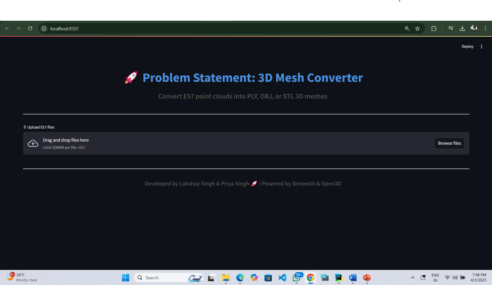
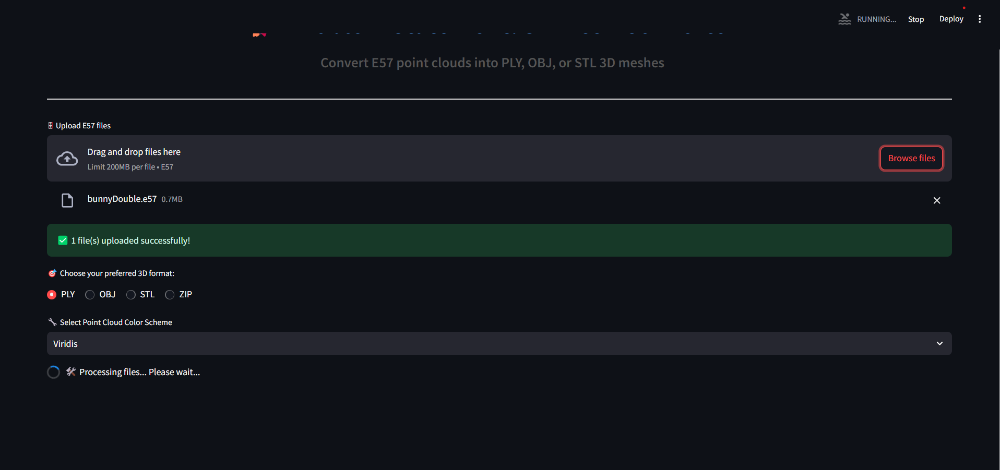
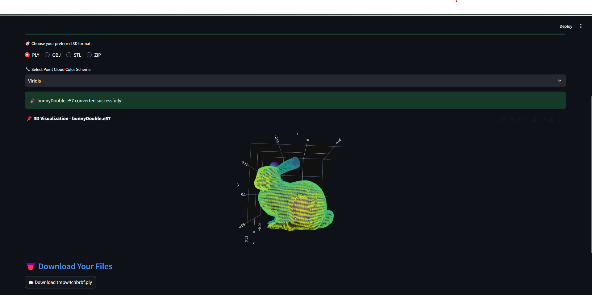
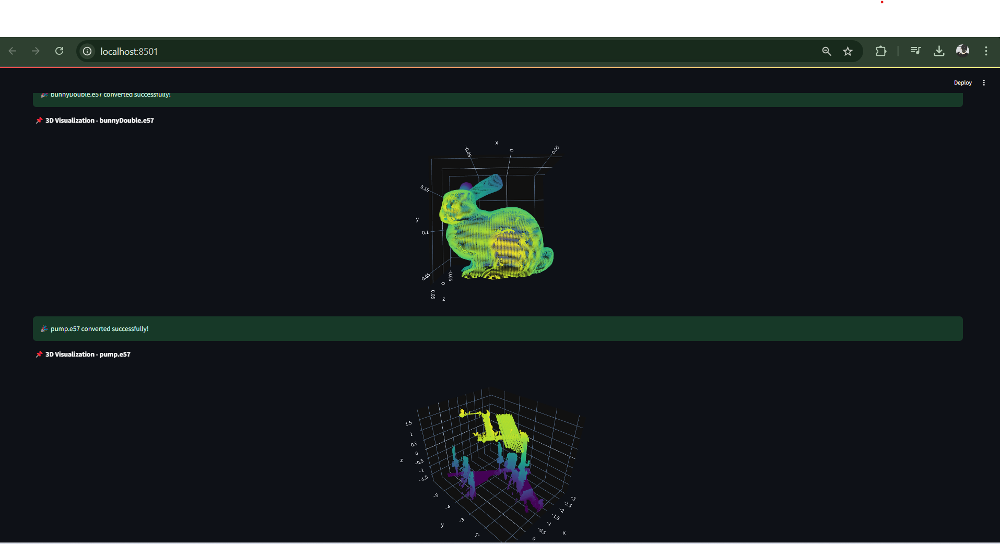

# 🎨 3D Mesh Convertor  

**🚀 Hackwell Hackathon Project by Team_Bug**  

🔹 **Team Name:** Team_Bug  
🔹 **Team Members:** Lakshay Singh & Priya Singh  
🔹 **Problem Statement:** 3D Mesh Convertor 

 
A Python-based **E57 point cloud viewer** that displays **real-world colors** using Open3D and PyQt5.  

---


# 📌 **Algorithm Explanation**  

###  **1. Statistical Outlier Removal (SOR) Algorithm**  
👉 **Purpose:** Removes unwanted noise from the point cloud by analyzing point density.  

🔹 **How It Works:**  
- Calculates the mean distance of each point to its `N` nearest neighbors.  
- Finds points that deviate from the mean distance by more than `std_ratio`.  
- Filters out those points as outliers.  

🔹 **Python Code for SOR:**  

```python
def remove_outliers(point_cloud, nb_neighbors=20, std_ratio=2.0):
    """Removes statistical outliers from the point cloud."""
    cl, ind = point_cloud.remove_statistical_outlier(nb_neighbors=nb_neighbors, std_ratio=std_ratio)
    return cl
```
### **2. Ball Pivoting Algorithm (BPA) for 3D Mesh Generation**

### 🚀 **Overview**  
The **Ball Pivoting Algorithm (BPA)** is a meshing technique that converts a **point cloud** into a **structured 3D mesh** by rolling a virtual ball over the points and forming triangles.  

 🔹 **How Ball Pivoting Algorithm Works**  

1️⃣ **Estimate Normals:** Compute surface normals for better meshing accuracy.  
2️⃣ **Set Ball Radius:** The algorithm uses a **rolling ball** to determine connections.  
3️⃣ **Pivot Around Points:** The ball moves along the cloud, forming **triangles** where it touches three points.  
4️⃣ **Continue Until Completion:** The process repeats until all possible triangles are formed.  

📌 **Python Code for BPA Meshing**  

```python
import open3d as o3d
import numpy as np

def generate_mesh(point_cloud, radius_factor=1.5):
    """Generates a 3D mesh using the Ball Pivoting Algorithm (BPA)."""
    
    # Compute average nearest neighbor distance
    distances = point_cloud.compute_nearest_neighbor_distance()
    avg_dist = np.mean(distances)
    radius = avg_dist * radius_factor

    # Apply BPA to create mesh
    mesh = o3d.geometry.TriangleMesh.create_from_point_cloud_ball_pivoting(
        point_cloud, o3d.utility.DoubleVector([radius, radius * 1.5, radius * 2])
    )
    
    return mesh

```
---

## 🎯 **Features**  
👉 **Load E57 files** easily  
👉 **Extract true RGB colors** from the point cloud  
👉 **View the 3D scan** interactively  
👉 **User-friendly interface**  

---

## ⚙️ **Installation**  

### **1️⃣ Install Dependencies**  
Ensure you have **Python 3.8+** installed, then run:  

```bash
pip install open3d pye57 PyQt5 numpy
```

---

## 🚀 **Usage**
### **▶️ Run Backend**
```bash
python backend.py
```

### **▶️ Run Frontend**
```bash
streamlit run frontend.py
```

---
## 📸 Screenshot 
  
  

  


---

## 📝 License  
This project is open-source under the MIT License.  

---
